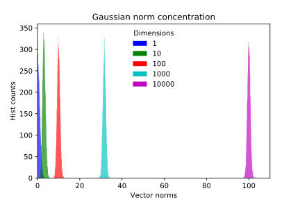

My intent with this post is to formalize thoughts I came accross while playing with generative models and especially VAEs. Firstly interested by visual aspects of latent space interpolation, I found myself digging deeper to gain high-dimensionnal intuitions and share here my understanding.

The toy we'll be playing with is a simple VAE. I will start by making a brief summary of AE and VAE principles and then move to latent space interpolations (where beautiful things happen).


## Auto-Encoders

Auto-encoders are unsupervised neural networks architectures used to encode data into **structured representations**. While they can be used for dimensionality reduction (instead of PCA or t-SNE for example) various other applications are being explored (anomaly detection, generative models, exploratory analysis...).

Unlike typical supervised tasks, an auto-encoder learns an identity function between its inputs and outputs. While in the former a neural network typically learns a mapping between input samples and output labels, the latter is optimized to reconstruct the input the best it can.

This objective is not inherently useful : what is interesting here lies in the hidden layers, or more simply in this example the middle layer $$\textbf{z}$$. We call $$\textbf{z}$$ the encoded or latent vector. The left part of the graph is the encoder part, it encodes the input into the latent space. The latent vector is then decoded by the decoder and outputs the input reconstruction. By setting the length of the middle vector $$\textbf{z}$$ to a smaller value than the input dimension, the mapping has to find an efficient way to compress input samples into a smaller representations. The mapping (set of neural weights and biases) is learnt during training phase by minimizing the reconstruction error. The loss is often chosen between MSE and cross-entropy.


*Usage example* : one wants to encode digits from their _28x28_ 2D representation to a more compact representation, i.e a vector of length 2. During training phase, many samples are proposed to the network with the reconstruction error between the original image and the reconstructed output image being minimized. In the middle of the network is specified an hidden layer - the 2-dim vector $$\textbf{z}$$ - so that all information *has* to be compressed into 2 values at some point. Obviously going from 784 dimensions to 2 is quite a drastic reduction, it forces the network to converge to efficient compression solutions. What we hope is that the low-dimensional representation is learning in an unsupervised way underlying concepts about the data (there are 10 digits, some orientation, thickness...) and encode each one of this concept into a dimension of the latent space. 

It makes sense, but it can cheat.

Suppose the dimension of $$\textbf{z}$$ is slightly higher. What mecanism can ensure that the learnt representation is not a dumb mapping between far apart regions of latent space and all input samples. Well nothing. For example the latent vector could easily encode each sample into binary positions and have very good reconstruction performance while having learn nothing about data structure.

Because the network finds its own ways to compress data, we can't understand fully its representation by looking at it. Nothing ensures that the vector $$\mathbf{z_1} = [2.2,1.3]$$ is decoded as an image of a 3 and $$\mathbf{z_2} = [2.2,1.3]$$, while very close in latent space, is *also* decoded as a 3. Any interpretation of what latent dimensions represent is here very difficult. 

Moreover, its hard to generate samples from this type of network. To generate a sample you have to find a latent vector $$\textbf{z}$$ that will produce, once decoded, a plausible output (in the sense similar to inputs on which the AE was trained). The manifold represented by all the latent vectors associated to input samples is probably not covering the entire $$\textbf{z}$$ space and sampling randomly will probably lead you into dead zones. 

These limitations, latent space interpretation and generation, are trying to be solved with VAEs.

## Variational Auto-Encoders

I was lately interesed in VAEs or Variational Auto-Encoder. This name is actually a contraction of two fields not typically associated : variationnal inference and deep learning auto-encoders. Here is my attempt to explain VAEs as clearly as possible (a bit of math but nothing too complicated).

A VAE is an auto-encoder with stochastic components. The main motivation behind this design is to provide generative capabilities to the model by constraining the latent space shape.

It would be nice to be able to sample latent vectors from well known distributions and get from the decoding network plausible samples. VAEs precisely to that : in addition to regular AE behaviour i.e identity reconstruction, we constrain the latent space with a specified distribution, or prior (often noted as $$P(z)$$). The new loss function now has to penalize bad reconstruction performance (same as in AEs) and unconstrained latent representation. To make sure the latent representation is well contrained by our prior we can compute a distance between actual latent space distribution $$Q(z\mid x)$$ and our chosen prior $$P(z)$$ and minimize it. 

An easy to sample from and simple prior we can use is the unit centered multivariate normal  $$P(z) \sim \mathcal{N}(\textbf{0}, I)$$. 

KL-divergence is often used to compare two distribution. Our final loss can then be expressed as :

$$\mathcal{L} =  -E_{z\sim Q(z\mid x)}[log(p(x\mid z))] + KL(Q(z\mid x)\mid \mid P(z))$$

We then take the assumption that the posterior is following a isotropic Gaussian distribution to simplify the KL divergence calculus ($$\mathbf{z}$$ has dimension $$D$$):

$$Q(\textbf{z}\mid x) \sim \mathcal{N}(\mu(x), \sigma^{2}(x) I)$$ 

$$KL(Q(z\mid x)\mid \mid P(z)) = -\frac{1}{2}\sum_{d=1}^{D}(1+log(\sigma^{2}_d)-\mu^{2}_d-\sigma^{2}_d)$$

It also has the avantage to simplify our architecture : the encoder network only encodes two vectors for each sample : one of means and one of variances . The real latent vector is then sampled from the multivariate normal distribution. The training phase ensure that the posterior $$Q(z\mid x)$$ doesn't get too far from the prior $$P(z)$$ while also giving good reconstruction performance.

I personnaly consider I don't fully understand a concept if I can't make it work in pratice. See a simple VAE implementation in PyTorch. <GIT LINK>

By running the network on MNIST with a latent space of dimension 2 we can then explore latent space representation, a very visual part.


### Latent space

Latent variables are not observed variables that are describing the underlying properties of a process. For example, the vector $$\theta$$ of a observed sequence of $$x \sim \mathcal{N}(\theta, \sigma)$$ is a latent variable. We only get to see $$x_i$$ while hidden $$\theta$$ describe the underlying generating process from which observations are sampled.

The mean of a Gaussian distribution is not a very interesting latent variable (compared to what we *can* find). These days, variational auto-encoders are very popular. A large part of this hype is due to their ability to *infer* latent variables for a large scope of problems. Moreover, found latent variable are constrained to be relevant and we, *humans*, can sometimes interpret them. 

We can use visual tools to explore latent space and understand what the model is doing.

## 2D Latent Space on MNIST VAE

Humans are very limited because we can visualize things up to 3 dimensions naturaly. Let's see what a 2-dimensional latent space looks like on a VAE trained on MNIST samples. As explained previously, we can generate latent vector by sampling from our prior $$P(z) \sim \mathcal{N}(\textbf{0}, I)$$. Sampling from this distribution will yield to random samples belonging to the 2D plane with many samples being generated near the mean $$[0,0]$$. If we want to explore the latent space smoothly we can ignore gaussian sampling and follow a continuous path on the 2D plane where our prior has high probability. The first idea we can get is to decode latent vectors belonging to a centered grid in latent space. In Python / PyTorch we could decode each grid point (latent vector) and display each output and the 2D plane.

```python
for i in x:
      for j in y:
          z = Variable(torch.FloatTensor([i, j])).cuda()
          sample = model.P(z).cpu()
          sample = sample.data.cpu().numpy().reshape(28,28)
          final_img_grid[x_pixel:x_pixel+28, y_pixel:y_pixel+28] = sample
          y_pixel += 28
      x_pixel += 28
y_pixel = 0
```


Beautiful isn't it ? The most fascinating thing is the smooth transitions between each of our human concepts (digits). Even if we have only two dimension, we can already see glimpses of the learned structure. The first dimension of $$\mathbf{z}$$ encodes a bit the orientation attribute. See how negative value are tilted right, while positive values are tilted right. Obviously, 2 dimensions is very small, so the network has to encode other concepts in this dimension introducing correlated attributes.

The grid sampling is pretty but static, how is it like to move inside this space ?

We can set up a simple parametric curve describing a spiral inside the domain $$x, y \in [-2,2]$$ and decode at regular interval (in parametric space) the latent vector to output the image. We visualize the curve overlayed on the gaussian prior, the latent vector at time t and the corresponding decoded image.

<div style="text-align:center;">
<video  style="margin: 0 auto; width: 100%; max-width: 1020px;" autoplay loop="loop">

```
   <source src="../images/animation.mp4" type="video/mp4" />
```

   </video>
</div>

### What about higher dimension ? 

Going up in dimensions for $$\mathbf{z}$$ is fairly easy in code, but we have to be careful when exploring high-dimensional spaces. After seeing the 2D grid, it's easy to think about a 3D box. Now think about a 100D box. Hard right ? Not only it's impossible for us to have a visual representation of such objects, but our intuition in low dimensional spaces are just wrong as we go up in dimensions.

Let's think about a simple object : all its points are at the same distance of another center point. In 2D it's called a circle, in 2D a sphere ... Now let's compute a basic property of this object :

Area of the unit-circle : $$V_2 = \pi$$

3D : Volume of unit-sphere : $$V_3 = \frac{4}{3}\pi​$$ 

4D : Volume of unit 4-sphere : $$V_4 = \frac{1}{2}\pi^{2}$$ 

The volume seems to increase, nothing strange.

General expression : $$V_n={\pi^{n/2}\over \Gamma(n/2+1)}$$


Oops. This is something our intuition has struggles dealing with. How does it have consequences in high-dimensionnal space exploration ? Well because the volume of hyperspheres goes to 0 as dimensions increase, gaussian sampling is a bit *different*. While a multivariate normal still has its maximum at the origin, if we were to compute the probability that samples belong to a n-sphere centered at origin we would integrate the density on the hypersphere volume, as to say 0. Hmm. This mean we have a very low probability of having samples close to origin (which is not the case in low-dimension). More precisely, as we have to increase the radius of the n-sphere for it to have a sufficient volume and therefore a bit of gaussian integrated density, there is a gap where almost no sample are sampled. All sampling is concentrated within a slice a the space. We can see it in action by plotting the norm of sampled vector for multivariate normal of various dimensions :




