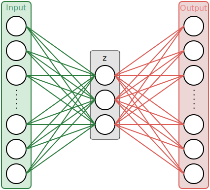
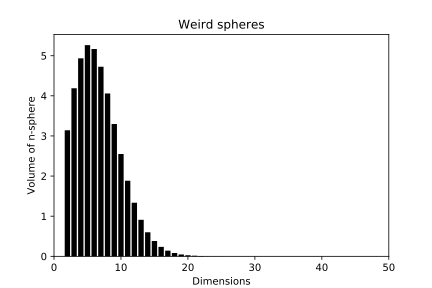
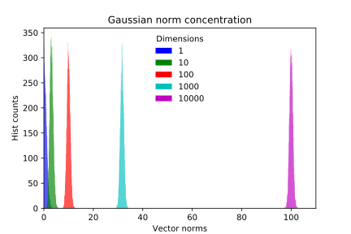
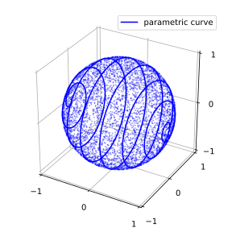
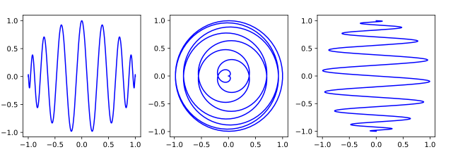
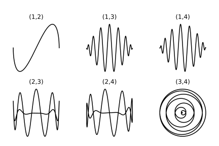
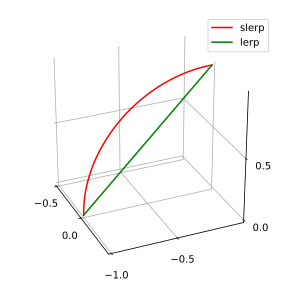
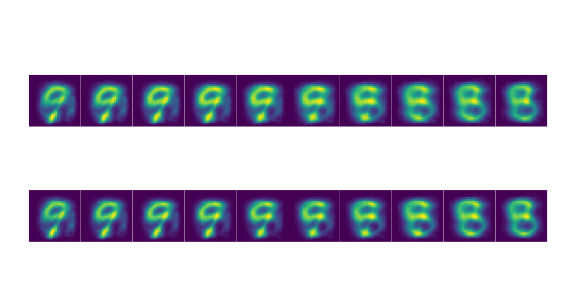
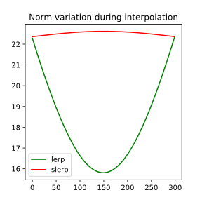

My intent with this post is to formalize thoughts I came across while playing with generative models and especially VAEs. Firstly interested by visual aspects of latent space interpolation, I found myself digging deeper to gain high-dimensionnal intuitions and share here my understanding.

The toy we'll be playing with is a simple VAE. I will start by making a brief summary of AE and VAE principles and then move to latent space interpolations (where beautiful things happen).


## Auto-Encoders

Auto-encoders are unsupervised neural networks architectures used to encode data into **structured representations**. While they can be used for dimensionality reduction (instead of PCA or t-SNE for example) various other applications are being explored (anomaly detection, generative models, exploratory analysis…).

Unlike typical supervised tasks, an auto-encoder learns an identity function between its inputs and outputs. While in the former a neural network typically learns a mapping between input samples and output labels, the latter is optimized to reconstruct the input the best it can.

This objective is not inherently useful, we are more interested in what lies in the hidden layers, or for this example the middle layer $$\textbf{z}$$. We call $$\textbf{z}$$ the **encoded** or **latent** vector. The left part of the graph is the encoder part, it encodes the input into the latent space. The latent vector is then decoded by the decoder and outputs the input reconstruction. By setting the length of the middle vector $$\textbf{z}$$ to a smaller value than the input dimension, the mapping has to find an efficient way to compress input samples into a smaller representations. The mapping (set of neural weights and biases) is learned during training phase by minimizing the reconstruction error. The loss is often chosen between MSE (Mean Squared Error) and cross-entropy.

<p align="center">

</p>

*Usage example* : one wants to encode images of digits from their _28x28_ pixels 2D representation to a more compact representation, i.e. a vector of length 2. During training phase, many samples are proposed to the network with the reconstruction error between the original image and the reconstructed output image being minimized. In the middle of the network is specified an hidden layer - the 2-dim vector $$\textbf{z}$$ - so that all information *has* to be compressed into 2 values at some point. Going from 784 dimensions to 2 is quite a drastic reduction, it forces the network to converge to efficient compression solutions. What we hope here is that the low-dimensional representation will learn in an unsupervised way underlying concepts about the data (there are 10 digits, some orientation, thickness…) and encode each one of this concepts into a dimension of the latent space. 

It makes sense, but the auto-encoder *can* cheat.

Suppose the dimension of $$\textbf{z}$$ is slightly higher. What mecanism can ensure that the learned representation is not a trivial mapping between far apart regions of latent space and all input samples. Well, nothing. For example, the latent vector could easily encode each sample into binary positions (0001, 0010, 0011…) and have excellent reconstruction performance while having learn **nothing** about data structure.

Because the network finds its own ways to compress data, we can't understand fully its representation by looking at it. Nothing guarantees that the vector $$\mathbf{z_1} = [2.2,1.3]$$ is decoded as an image of a 3 and $$\mathbf{z_2} = [2.1,1.4]$$, while very close in latent space, is decoded as an image *also* looking like a 3. Any interpretation of what latent dimensions represent is here arduous. 

Moreover, its hard to generate samples from this type of network. In order to generate a sample you have to find a latent vector $$\textbf{z}$$ that will produce, once decoded, a plausible output (in the sense similar to inputs on which the AE was trained). The manifold represented by all the latent vectors associated to input samples is probably not covering the entire $$\textbf{z}$$ space and sampling randomly will surely yields unprobable results. 

These limitations, latent space interpretation and generation, are trying to be solved with VAEs.

## Variational Auto-Encoders

I was lately interesed in VAEs or Variational Auto-Encoder. This name is actually a contraction of two fields not typically associated : variational inference and deep learning auto-encoders. Here is my attempt to explain VAEs basic necessary principles to understand latent space exploration (a bit of math but nothing too nerdy).

A VAE is an auto-encoder with stochastic components. The main motivation behind this design is to provide generative capabilities to the model by constraining the latent space shape.

The nice feature we want is to be able to sample latent vectors from well known distributions and get from the decoding network plausible samples. VAEs precisely to that : in addition to regular AE behaviour i.e. identity reconstruction, we constrain the latent space with a specified distribution, or prior (often noted as $$P(z)$$). The new loss function now has to penalize **bad reconstruction** performance (same as in AEs) and **unconstrained latent representation**. To make sure the latent representation is well contrained by our prior we minimize a distance between actual latent space distribution $$Q(z\mid x)$$ and our chosen prior $$P(z)$$. 

An easy to sample from and simple prior we use is the unit centered multivariate normal. 

$$P(z) \sim \mathcal{N}(\textbf{0}, I)$$

KL-divergence is often used to compare two distribution. Considering all elements, our final loss can then be expressed as :

$$\mathcal{L} =  -E_{z\sim Q(z\mid x)}[log(p(x\mid z))] + KL(Q(z\mid x)\mid \mid P(z))$$

We then take the assumption that the posterior is following an isotropic Gaussian distribution to simplify the KL divergence calculus ($$\mathbf{z}$$ has dimension $$D$$). If you want details you can check the demonstration in the [original paper]([https://arxiv.org/abs/1312.6114])

It also has the avantage to simplify our architecture : the encoder network only encodes two vectors for each sample : one of means and one of variances (the Gaussian components are supposed independent hence the need for only one variance **vector**). Many realizations of latent vectors can then sampled from the multivariate normal distribution. The training phase ensures that the posterior $$Q(z\mid x)$$ doesn't get too far from the prior $$P(z)$$ while also giving good reconstruction performance.

I personnally consider I don't fully understand a concept if I can't make it work in practice. See this simple VAE implementation in PyTorch at [github.com/alelouis/vae](https://github.com/alelouis/vae). I recommand playing with it and reimplementing it as an exercise. 

By running the network on MNIST with a latent space of dimension 2 we can explore the latent space manifold, a very visual part.

-----

## Latent space interpolations

Latent variables are *not observed* variables that are describing the underlying properties of a process. For example, the vector of means $$\theta$$ of an observed sequence of observations $$x \sim \mathcal{N}(\theta, \sigma)$$ is a latent variable. We only get to see $$x_i$$ while hidden $$\theta$$ describe the underlying generating process from which observations are sampled.

The mean of a Gaussian distribution is not a captivating latent variable (compared to what we *can* find). Last years have seen a growing hype for latent variable generative models such as variational auto-encoders. A large part of this enthusiasm is due to their ability to *infer* latent variables, real explanatory variables, for a large scope of problems. Moreover, found latent variable [can be constrained](https://docs.google.com/presentation/d/12uZQ_Vbvt3tzQYhWR3BexqOzbZ-8AeT_jZjuuYjPJiY/pub?start=true&loop=true&delayms=30000#slide=id.g1329951dde_0_0) to be relevant and we, *humans*, can sometimes interpret them. 

We can use visual tools to explore latent space and understand what the model is doing.

## 2D Latent Space on MNIST VAE

Humans are very limited (yes), one reason why is that we can't visually conceptualize objects in more than 3 dimensions. Fortunatly we can use maths to understand hidden behaviors even if we can't *see* the phenomenons. But to start let's stick to our comfort zone. We will sneak peek into a 2-dimensional latent space from a VAE trained on MNIST samples. As explained previously, we can generate latent vectors by sampling from our prior $$P(z) \sim \mathcal{N}(\textbf{0}, I)$$. Sampling from this distribution gives us random samples belonging to the 2D plane with many samples being generated near the mean $$[0,0]$$. If we want to explore the latent space smoothly we can ignore Gaussian sampling for a moment and follow a continuous path on the 2D plane where our prior has high probability. The first idea we can get is to decode latent vectors belonging to a centered grid in latent space. In Python / PyTorch we could decode each grid point (latent vector) and display each output and the 2D plane.

```python
for i in x:
      for j in y:
          z = Variable(torch.FloatTensor([i, j])).cuda()
          sample = model.P(z).cpu()
          sample = sample.data.cpu().numpy().reshape(28,28)
          final_img_grid[x_pixel:x_pixel+28, y_pixel:y_pixel+28] = sample
          y_pixel += 28
      x_pixel += 28
y_pixel = 0
```

{: .center-image }

That's pretty. The most fascinating thing is the smooth transitions between each of our human concepts (digits). Even if we have only two dimension, we can already see glimpses of the learned structure. The first dimension of $$\mathbf{z}$$ encodes a bit the orientation attribute. See how generated images in the negative $$\mathbf{z_1}$$values are tilted left, while positive values are tilted right. By setting intentionnally 2 latent dimensions thee network has to encode many concepts within the same dimensions introducing correlated attributes.

The grid sampling is pretty but static, how is it like to *move* inside this space ?

We can set up a simple parametric curve describing a spiral inside the domain $$x, y \in [-2,2]$$ and decode at regular interval (in parametric space) the latent vector to output the image. 

$$\begin{array}{lcl} x(t) & = & (0.1\cdot t\cdot 2 - 2)\cdot \sin(t) \\ y(t) & = & (0.1\cdot t\cdot 2 - 2)\cdot \cos(t) \\ t & \in & [0,3\pi]\end{array}$$

We visualize the trace of $$(x(t), y(t))$$ overlayed on the Gaussian prior, the latent vector components at time $$t$$ and the corresponding decoded image.

<div style="text-align:center;">
<video  style="margin: 0 auto; width: 100%; max-width: 1020px;" autoplay loop="loop">

```
   <source src="../images/animation.mp4" type="video/mp4" />
```

   </video>
</div>

## What about higher dimensions ? 

Going up in dimensions for $$\mathbf{z}$$ is fairly easy in code, but we have to be careful when exploring high-dimensional spaces. After seeing the 2D grid, it's easy to think about a 3D box. Now think about a 100D box. Hard right ? Not only it's impossible for us to have a visual representation of such objects, but our intuition in low dimensional spaces are just wrong as we go up in dimensions.

To demonstrate how bad our intuitions can be let's think about a simple object : all its forming points are at the same distance of another point, called the center. In $${\rm I\!R^2}$$ it's called a circle, in $${\rm I\!R^3}$$ a sphere ... Now let's compute a basic property of this object :
- Area of the unit-circle : $$V_2 = \pi$$
- Volume of unit-sphere : $$V_3 = \frac{4}{3}\pi​$$ 
- Volume of unit 4-sphere : $$V_4 = \frac{1}{2}\pi^{2}$$ 

The volume seems to increase, nothing strange.
Funny things happen when considering the general expression : 

$$V_n={\pi^{n/2}\over \Gamma(n/2+1)}$$



Oops. This is something our intuition has struggles dealing with. Now, this surely has consequences in high-dimensionnal space exploration. In fact, because the volume of hyperspheres goes to 0 as dimensions increase, Gaussian sampling is a bit *different*. While a multivariate normal still has its maximum at the origin, if we were to compute the probability that a sample belongs to a given domain, like a unit $$n$$-sphere centered at origin, we would integrate the density on the hypersphere volume (an hyperball ? puns.), which is very close to 0 for large $$D$$. This means we have a very low probability of having samples close to origin (which is not the case in low-dimensions). More precisely, for the very reason we have to increase the radius of the $$n$$-sphere significantly for it to have a sufficient volume and therefore a bit of Gaussian integrated density, there is a gap with almost zero probabilty. All sampling is concentrated within a slice of the space. We can check this phenomenon by plotting the norm of sampled vectors for multivariate normal of various dimensions :



This is what is called the **norm concentration** : for large dimensions $$p$$ all the samples have their $$L^{p}$$ norms concentrated in an annulus of radius $$\sqrt{p}$$. This is very similar to what a uniform spherical distribution would give us. This has serious implication when latent space interpolation is used in high dimensions. As we were wandering around within a grid in 2D space or a box in 3D, we were actually *covering* the prior distribution used by our model. With Gaussians behaving like spherical uniform distributions in high dimensions, we have to make sure we are exploring space *within* high probability spaces. One way is to only decode latent vector having an $$L^{p}$$ norm of $$\sqrt{p}$$ (or belonging to a $$p$$-sphere of radius $$\sqrt{p}$$). Said differently we can move on the surface of an $$n$$-sphere. The use of spherical coordinates is well suited here. Everyone is well aware of 2 (maybe 3) dimensions equations systems, but here is the $$n > 3$$ version :

$$\begin{align}
x_1 &= r \cos(\theta_1) \\
    &\vdots\\
x_{n-1} &= r \sin(\theta_1) \cdots \sin(\theta_{n-2}) \cos(\theta_{n-1}) \\
x_n &= r \sin(\theta_1) \cdots \sin(\theta_{n-2}) \sin(\theta_{n-1})\\
\theta_{1...n-2} &\in [0,\pi]\\
\theta_{n-1} &\in [0,2\pi]
\end{align}
$$

For instance, the surface of a $$5$$-sphere of radius $$r$$ can be parameterized with these 5 cartesian coordinates
(the color coding shows how I remember the structure):

$$\begin{align}
\definecolor{r}{RGB}{18,110,213}
\definecolor{sin}{RGB}{217,70,70}
\definecolor{cos}{RGB}{10,150,40}


x_1 &= \color{r} r \color{cos} \cos(\theta_1) \\
x_2 &= \color{r} r \color{sin} \sin(\theta_1)\color{cos} \cos(\theta_2) \\
x_3 &= \color{r} r \color{sin} \sin(\theta_1)\sin(\theta_{2})\color{cos}\cos(\theta_{3}) \\
x_4 &= \color{r} r \color{sin} \sin(\theta_1)\sin(\theta_{2}) \sin(\theta_{3})\color{cos}\cos(\theta_{4})\\
x_5 &= \color{r} r \color{sin} \sin(\theta_1)\sin(\theta_{2}) \sin(\theta_{3})\sin(\theta_{4})
\end{align}
$$

I can't really figure out what individual dimensions in theses equations are actually doing in $${\rm I\!R^n}$$ spaces, what I can do however is plot the $${\rm I\!R^3}$$ system. By setting all $$\theta_{1...n-2}$$ between $$[0,\pi]$$ with $$\theta_{n-1}$$ covering a multiple of $$2\pi$$ I can explore the sphere in a continuous spiraling effect. The blue line is the 3D version path we will likely take to explore high dimensional $$\mathbf{z}$$ spaces while all blue scatter points are potential realization of a spherical uniform distribution (approximation to what an $${\rm I\!R^n}$$ Gaussian really is).




## Exploring the entire space 

I trained another VAE with this time 10 dimensions for $$\mathbf{z}$$. Because I can't plot the path taken, I want to be sure I cover a large part of the $$n$$-sphere surface as I did in the $${\rm I\!R^3}$$ version by making many loops around the ball. To really understand what the equations are describing I find it usefull to look the 3 projections of the previous path. It's easy to see how $$\theta_{2}$$ is parameterizing a circle ($$\cos(\theta_{2})$$ and $$\sin(\theta_{2})$$) which is scaled by the $$\sin$$ sequence preceding it. The two other planes simply cover a semi-circle modulated on one component by the spiral amplitude. Simiar things happens in higher dimensions, with only the last two $$x_{n}$$ and $$x_{n-1}$$ describing a spiral (which is why we will make $$\theta_{n-1}$$ cover of large multiple of $$2\pi$$) and all the other planes covering the $$n-1$$ $$[0,\pi]$$ intervals. 



Here are the 6 slices of a $$4$$-sphere : 




One way to increase the length of the interpolation animation is to explore a denser mesh on the hypersphere surface. The interval covered by $$\theta_{n-1}$$ determines the number of loops done. A period of $$2\pi$$ means that the start point is reached at the end point. A period of $$2n\pi$$ means the start point is reached $$n$$ time forming $$n$$ loops. Therefore, the mesh density could be tweaked with the number of $$\theta_{n-1}$$ periods done while $$\theta_{1...n-2}$$ go through $$[0,\pi]$$. This is useful to create fluid and continuous interpolations in high dimensional latent spaces and is a generalization of the animated plot saw earlier.

### Interpolating between two points 

To illustrate low probabilty space bad representation we can interpolate throught latent space via linear and spherical methods. Linear methods will inevitably yields to sampling *inside* the hypersphere while spherical will stay on the surface. Here we go for the slerp & lerp :  

$$ \textbf{lerp}(i,j,t) = i + t(j-i) $$  
  
$$ \textbf{slerp}(i,j,t) = i\frac{\sin((1-t)\theta)}{\sin(\theta)} + j\frac{\sin(t\theta)}{\sin(\theta)}$$



I generated two random gaussians samples from the prior, normalized, scaled them and then interpolated between the two using lerp and slerp methods.


The top row are samples belonging to the lerp segment while the bottom is taken from the slerp arc. The VAE was trained with 500 (!) latent dimensions so that the Gaussian distribution can be though as an uniform hyperspherical of radius $$\sqrt{500} \approx 22$$. While the VAE has fairly bad representations, the aim here is to show that the top row has *noisier* representations during lerp interpolation. It's easy to compare images from the middle of the rows and notice on lerp path that digits are more blurry and not well defined compared to the slerp path results. We can plot for the two last paths the norms of the interpolated latent vectors. Without surprise the lerp goes way below the annulus of radius 22 and we can expect (and we saw that) worst reconstructions at mid-interpolation.



**Personnal reminder** : high dimensions are weird and intuitive ideas are often bad.

## Conclusion 
I hope you found this post interesting, that it raised questions that you didn't necessarly think about and stimulated your curiosity. Stay curious ! 