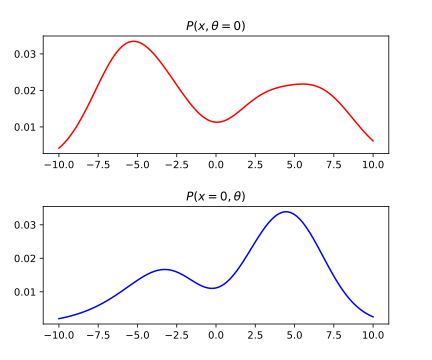
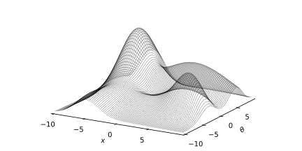

## Joint, marginal and conditional, probabilities visualized

Being a visual type of person (if that's actually a thing), I like thinking about concept visualy. It's not rare to have many interpretations of the same concepts and each one of us choose a mental model that suits us the best when learning new things.  

I remember struggling to get my visual mental models right about probabiliy densities at first. While this is not typically the way it is teached, I find it easier to mentally understand and anticipate probability mechanics by visual means. I share here a graphical approach for theses concepts : 
- Joint probability density : $$p(x, \theta)$$
- Marginal density : $$p(x)$$
- Conditional density : $$p(x\mid \theta)$$
- Likelihood : $$L(\theta\mid x)$$

## Joint probability density
Joint distribution describre co-occurence of events. In terms of continuous distributions they are often noted as follow :  

  

$$p(x,\theta)$$  

That is the distribution describing the joint probability of random variables $$x$$ and $$\theta$$. For univariate RV $$x$$ and $$\theta$$, the bivariate joint density $$p(x,\theta)$$ can be represented as a surface (see fig.1). Integrating a joint distribution on the whole domains of definition of its variables gives one.  

$$\iint p(x,\theta)\;dxd\theta= 1$$  

We can fix any of the random variables and see the behavior of the other variables by **slicing** the joint distribution (red and blue lines).
Note that $$p(x=0,\theta)$$ and $$p(x,\theta=0)$$ are not probability densities as they don't integrate to 1.

 

The whole shape of the curve is nonetheless interesting as we will see in conditional densities part.
If we were to integrate either of those curves it would give us the **marginal** probabilities of the fixed parameters at the fixed value. For instance :  

$$p(x=0) = \int p(x=0,\theta)\;d\theta$$  

$$p(\theta=0) = \int p(x,\theta=0)\;dx$$  

We saw here a glimpse of what actually are marginal probabilities which are developed in the next section.
## Marginal density
A marginal density represents the density of a unique random variable.  

$$p(x), p(\theta)$$  

In case where the marginal is not specified, we can (in theory) fully recover it from the joint density. As noted earlier, integrating a slice of joint density at a given point equals the marginal at the very same point. The whole marginal density can be computed in a similar fashion. By taking many slices over a parameter and calculating the corresponding integral, we recover for each $$x$$ value the corresponding area value / marginal value.

 

$$p(x) = \int p(x,\theta)\;d\theta$$  

On the above graph are drawn many $$p(x=k,\theta)$$ which once integrated / marginalized w.r.t $$\theta$$ equals $$p(x=k)$$. If we were to plot $$p(x=k)$$ for infinitesimal $$k$$ values we would obtain $$p(x)$$ :  

GRAPH  

Some properties appear obvious while reasoning geometrically : 
- $$p(x)$$ integrates to one as integrating over all the slices effectively integrates the whole joint density. 
- $$p(x)$$ doesn't depend on any other variable, as they have been **integrated** into the marginal.
- *Caution* : $$p(x)$$ computation seems straight forward geometrically but can actually be intractable analytically (and hard numerically too).

## Conditional density

WIP
## Appendice : Likelihood

