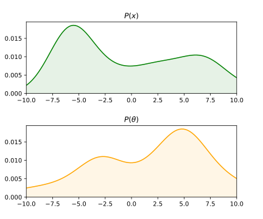
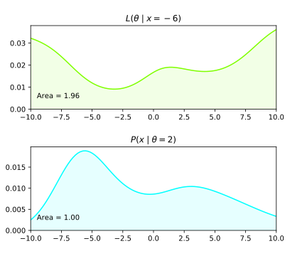

## Joint, marginal and conditional, probabilities visualized

Being a visual type of person (if that's actually a thing), I like thinking about concepts visually. It's not rare to have many interpretations of the same concepts and each one chooses a mental model that suits us the best when learning new things.  

I remember struggling to get my visual mental models right about probabiliy densities at first. While this is not typically the way it is teached, I find it easier to mentally understand and anticipate probability mechanics by visual means. I share here a graphical approach for theses concepts : 
- Joint probability density : $$p(x, \theta)$$
- Marginal density : $$p(x)$$
- Conditional density : $$p(x\mid \theta)$$
- Likelihood : $$L(\theta\mid x)$$

**Warning** : this is not supposed to be a rigorous approach to theses concepts, just intermediates mental models that can help some of you gaining intuitions about theses ideas.

## Joint probability density
Joint distribution describre co-occurence of events. In terms of continuous distributions they are often noted as follow :  

  

$$p(x,\theta)$$  

That is the distribution describing the joint probability of random variables $$x$$ and $$\theta$$. For univariate RV $$x$$ and $$\theta$$, the bivariate joint density $$p(x,\theta)$$ can be represented as a surface (see fig.1). Integrating a joint distribution on the whole domains of definition of its variables gives one.  

$$\iint p(x,\theta)\;dxd\theta= 1$$  

We can fix any of the random variables and see the behavior of the other variables by **slicing** the joint distribution (red and blue lines).
Note that $$p(x=0,\theta)$$ and $$p(x,\theta=0)$$ are not probability densities as they don't integrate to 1.

 

The whole shape of the curve is nonetheless interesting as we will see in conditional densities part.
If we were to integrate either of those curves it would give us the **marginal** probabilities of the fixed parameters at the fixed value. For instance :  

$$p(x=0) = \int p(x=0,\theta)\;d\theta$$  

$$p(\theta=0) = \int p(x,\theta=0)\;dx$$  

We saw here a glimpse of what actually are marginal probabilities which are developed in the next section.
## Marginal density
A marginal density represents the density of a unique random variable.  

$$p(x), p(\theta)$$  

In case where the marginal is not specified, we can (in theory) fully recover it from the joint density. As noted earlier, integrating a slice of joint density at a given point equals the marginal at the very same point. The whole marginal density can be computed in a similar fashion. By taking many slices over a parameter and calculating the corresponding integral, we recover for each $$x$$ value the corresponding area value / marginal value.

 

$$p(x) = \int p(x,\theta)\;d\theta$$  

On the above graph are drawn many $$p(x=k,\theta)$$ which once integrated / marginalized w.r.t $$\theta$$ equals $$p(x=k)$$. If we were to plot $$p(x=k)$$ for infinitesimal $$k$$ values we would obtain $$p(x)$$, similar operation for $$p(\theta)$$ :  

   

Some properties appear obvious while reasoning geometrically : 
- $$p(x)$$ integrates to one as integrating over all the slices effectively integrates the whole joint density. 
- $$p(x)$$ doesn't depend on any other variable, as they have been **integrated** into the marginal.
- *Caution* : $$p(x)$$ computation seems straight forward geometrically but can actually be intractable analytically (and hard numerically too).

## Conditional density

Conditional densities will appear here very easy with what we already saw. Remember the slices we were taking inside the joint distributions, they weren't really distributions because they didn't integrated to one. Now if we normalize the slices by its areas, we obtain the conditional distributions of a variable **given** the other.  

  

For example, consider the slice $$p(x,\theta=0)$$, in order to make it integrate to one we normalize this function by its area (which is also the marginal taken at slice point that is to say $$p(\theta=0)$$, we then obtain $$p(x\mid \theta=0)$$. This is obviously generalizable to all $$\theta$$ values. This actually gives us the definition of a conditional probability :  

$$p(x\mid \theta) = \frac{p(x,\theta)}{p(\theta)}$$

Notice how they have exactly the same shape as joint slices, the only difference being that they are normalized. We can wonder what looks like $$p(x\mid \theta)$$ over all the different $$\theta$$ : 

  

$$p(x\mid \theta)$$  

With a bit a training this type of result can easily become intuitional. All we did to obtain this surface (and not a real probability distribution as it does *not* integrates to one) from the joint is divide the whole joint distribution by the marginal of $$\theta$$. I represented it in **orange** on the graph so you can mentally understand how the marginal division affected the whole shape of the joint. From this surface each slice along the $$\theta$$ axis represents the conditional distribution of $$x$$ given the $$\theta$$ slice point. But what does represent a slice along this $$x$$ axis into this surface ?

## Appendice : Likelihood

The word likelihood is used in many contexts and often exchanged without precaution to mean probability. I will show you here how to visualize likelihood and how we can derive some properties of it. The previous surface we plotted represented the conditional distributions $$p(x\mid \theta)$$ when considering fixed $$\theta$$. We obtained it by dividing the joint distribution by the marginal of $$\theta$$. Slicing along the $$\theta$$ axis for different $$\theta$$ values gives us many contional probabilities given the chosen $$\theta$$. Now if we were to consider cutting along the $$x$$ axis, what would we get ? It is not a distribution by construction since we only normalized along the $$\theta$$ axis. This slice represents the likelihood of $$\theta$$ given $$x$$. 

  

When considering $$p(x\mid \theta)$$ visually, each slice direction represents respectively a conditional probability and a likelihood. The likelihood definition can be thought as two way to describe the same surface. For conditional probability we travel along the $$x$$ axis fixing the $$\theta$$ while for likelihood we travel along the $$\theta$$ axis fixing the $$x$$.

$$L(\theta\mid x) = p(x\mid \theta)$$  

  

A nice intuition you can take from this is that it is now **obvious** that likelihood is **not** a probability distribution (even if its confusing looking at the definition).

##Conclusion