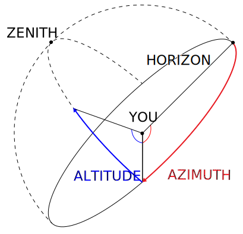
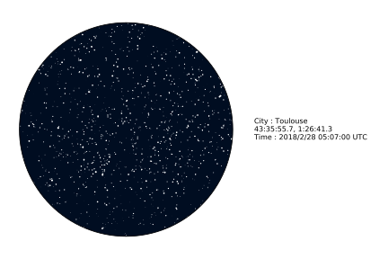

Only a few things are better than just looking at a clear sky for bright stars. In this what seems to be a perfectly still deep space picture, many things are in fact happening. Those who have played with long exposure photography know that the imperceptible earth rotation can reveal beautiful star movements patterns. We may also observe fast transiting bright spots, satellites. Some of what we call stars are in fact planets, or even geostationary satellites.

To better understand all these moving parts and predict what will show up in the sky we can now rely on computations. I will show you how by using simple libraries to plot beautiful stars and predict the future (regarding astronomy of course). Without further ado let's remember together the basics.

# Where am I?
## Right Ascension and Declination (RA & DEC)

A simple way to indicate any position and Earth is the Latitude / Longitude coordinates system. A similar approach can be applied to stars: we imagine a celestial sphere around Earth (with a big radius) which surface contains all the stars. Any object can be expressed as two angles: Right Ascension and Declination. These are analogs to Latitude and Longitude except for the fact that the 0° meridian for Declination is not related to the Greenwich meridian (which would make the coordinates Earth-rotation dependent) but pointed towards a fixed point in the sky. As a consequence, each object in the sky can be described by two values for all Earth observers independent of their positions.

## Azimuth and Altitude (AZ & ALT)

It's nice to have the absolute position of objects in the sky, but what if I want to know where to look and when to look from my city to see that ISS thing? We often use another set of coordinates which is observer dependent. Any object is again described by two values: Azimuth and Altitude. Altazimutal values are converted from Right Ascension and Declination values taking into account time and observer position on Earth. Altitude and Azimuth coordinates are very convenient to work with for any observer as they indicated angles relative to the local horizon. Azimuth makes you turn around, Altitude makes you raise your head.



# Make it roll

Since the 16-17th century, it is socially acceptable to say that the Earth is in rotation. This rotation is fairly slow (somewhere near 1600 km/h at equator), but who want shorter days anyway?

By summoning the power of trigonometry and well-written implementations we will fast forward sky movements and save you the bargain of doing 5 hours time-lapses in the outside world. [PyEphem](http://rhodesmill.org/pyephem/) is a library making it easy for a five y.o. to execute several astronomy computations, like convert RA / DEC to AZ / ALT coordinates. The first step is to gather a collection of star coordinates (here's one). The second step is to compute the actual position of these star in the sky of an observer (let's say me).
I live in Toulouse (43.6, 1.44) and I will go out on the 28th of February in the night, let's say 5:07:00 AM (obviously chosen randomly).

What I can do is plot each AZ / ALT coordinates on a polar plot with $$\theta$$ corresponding to Azimuth and $$r$$ corresponding to Altitude. I only care about plotting positive Altitude values, as I can't see (yet) through the dirt. I can also set a variable size for each star based on their magnitude for extra fanciness and voilà:



Yes, this is static. Because I only computed for one date there is not much happening. I can plot exactly the same plot but at a different time, or make it a sequence. Let's compute one frame every 30 seconds of real-time.


<div style="text-align:center;">
<video  style="margin: 0 auto; width: 100%; max-width: 1020px;" autoplay loop="loop">

```
   <source src="../images/sky-plot/iss.webm" type="video/mp4" />
```

   </video>
</div>

Oh, what's that? I told you unexpected thing happens while looking at the sky. To be honest, it wasn't random. I chose specifically a time when an ISS transit would occur above Toulouse. For each frame, I also plotted and evenly spaced time trace of the ISS which give us a sense of the apparent at which the transit will display. The end of the trail represents a lag of 50 seconds. (The big white point at the centered is the Zenith).

# What about satellites?

Satellites do not have fixed RA and DEC coordinates, so how do we know where to look? An easy way to describe satellites orbits is by using TLE (Two-Line Elements). Each satellite has a TLE, valid for a given time, specifying its launch and orbital characteristics. These TLE can be given as inputs to pyEphem to create a moving object. At any given time (within the limit of the TLE validity) we can then fetch the RA and DEC of the satellite. The website [celestrak](https://celestrak.com/) references more satellites than you need, including the last 30 days launches, exciting!

As an example, here is the last TLE of our beloved ISS:

ISS (ZARYA)             
1 25544U 98067A   18049.96745694  .00002668  00000-0  47552-4 0  9991
2 25544  51.6414 248.0688 0003322 111.2880 342.9259 15.54113204100135


# I want to play too, show me your magic tricks!

All the code used in this blog post is available as a Jupyter Notebook in this [Github repository](https://github.com/alelouis/moving-stars/).

Have a lot of fun, plot many satellites at once (I suggest you Galileo), vary positions at extravagant speeds or compute your next ISS transits!
