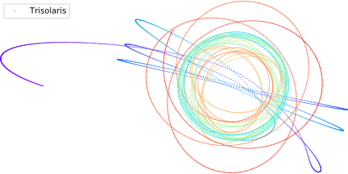
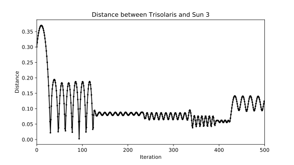
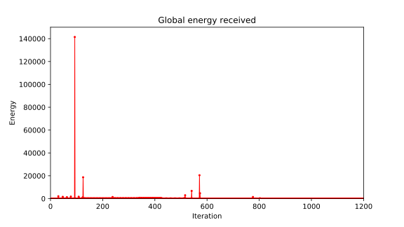

  
<br/>
<span style="color:#ff6872">Spoiler alert : before reading this post, you should read the [Three Body Problem from Cixin Liu](https://www.amazon.fr/dp/B00S8FCJCQ/ref=dp-kindle-redirect?_encoding=UTF8&btkr=1?target="_blank"). This post contains spoilers.</span>

Following a first contact with a distant alien civilization, a secret organization launches a virtual reality simulation of an irrational world. What we call Stable and Chaotic Eras follows one after another without any apparent logic. While in chaotic eras, day’s durations are unpredictable. Temperatures can drop or rise in a matter of minutes setting ablaze the entire planet surface. New players have one goal : explaining rationally the incomprehensible.

The first novel of the great trilogy immerses us on Trisolaris inhabited by Trisolarians. This planet belongs to a 3-solar system, guaranteeing mind blowing ephemeris. The dance of those three celestial bodies appears messy and random from the [wandering planet](https://www.amazon.com/Wandering-Earth-Cixin-Liu-ebook/dp/B01DMCBAW4/ref=sr_1_1?s=digital-text&ie=UTF8&qid=1524301774&sr=1-1&keywords=wandering+earth). Due to atmospheric properties, a Trisolarian can’t actually see three suns in its sky but only one at a time.

>“It’s a phenomenon akin to polarization or destructive interference. As a result, when we view the sun from within our atmosphere and it gets a certain distance from us, the gaseous outer layer suddenly becomes completely transparent and invisible, and all we can see is its bright inner core. The sun then appears to be only the size of the inner core, a flying star.”

Those who’ve have seen more suns than one at a time are no longer here for the record. After thoughtful observations and many ends of the world, one of the main characters understands the special celestial configuration.

>“It’s actually pretty simple. The reason why the sun’s motion seems patternless is because our world has three suns. Under the influence of their mutually perturbing gravitational attraction, their movements are unpredictable — the three-body problem.”

The 3-body problem studies a chaotic physical system, in which slight variations of initial conditions lead to unpredictable patterns. That does not mean it’s not deterministic, just unpredictable. Infinitesimal errors made on initial conditions measurement exponentially affect the behavior of the system with time. So because we can’t simulate the actual (non-real) trisolar system even if it existed, we will stick to run the physics of 3 gravitational bodies — actually 4 if we count Trisolaris.

I was eager to find out if Stable and Chaotic Eras would be reproduced, as well as flying stars scenarii.

>“When two flying stars appear, it means a Stable Era is about to begin. [...]
— If three flying stars appears, does that herald an even better era ?  [...]
— What are you talking about ? Three flying stars.. pray that such a thing never happens.”

There are little tricks to know to reproduce physically correct behaviors on computers. For n-body simulations the standard approach is to apply forces (accelerations) and integrate on small time-steps to obtain velocities or positions of objects. We can use various integration methods and it's generally a good idea to discard the Euler method, in my case I couldn't produce a system not collapsing after a few iterations. The Verlet integration gave me satisfying results.

$$x_{t+\Delta t} = 2 x_{t} - x_{t-\Delta t} + a {\Delta t}^2$$

I also slightly modified the gravitational force equation by adding an $$\epsilon$$ to ensure that we never reach (or approach) singularity.

$$\vec{F} = G\frac{m_A m_B}{(d+\varepsilon)^2}\vec{u}$$

The simulation was implemented in Python in pure numpy. For each body we apply the gravitational forces from all the other interacting objects.



import numpy as np
timestep = 1e-5
for t in time_vector:
  for body_id, body in enumerate(bodies):
    acc = np.zeros(2)
    for interact_id, interact in enumerate(bodies):
      if interact_id != body_id:
        diff_vector =  interact.position - body.position
        norm = np.linalg.norm(diff_vector)
        diff_vector /= norm
        acc += force*diff_vector*interact.mass/(norm + 0.1)**2
    position = 2 * body.position - body.previous + acc * timestep**2
    body.previous = body.position
    body.position = position


By logging the distances between Trisolaris and its three suns we can define Stable Eras and Chaotic Eras. A Stable Era corresponds to Trisolaris orbiting one Sun for a given period of time. The orbit can be seen as the oscillation of the distance between Trisolaris and one of its suns. In the referential of the Sun 3 we notice the Stable Era of Trisolaris with regular orbits.
<br/><br/><br/><br/>
  

  

<br/>
We see that the periods/amplitudes of the orbits vary at discrete times, this phenomenon is caused by the other suns closing-by and perturbing the stable system — the animation at the end of the post demonstrates it. Once pulled out of its regular orbit by other suns, the day-night cycle interrupts and chaos follows — until a new stable configuration is reached.

>“That the sun will not rise tomorrow is no less intelligible a proposition, and implies no more contradiction, than the affirmation, that it will rise.”  Hume (1772)
A Trisolarian kindergarten could have said that, [what are you talking about](https://bblais.github.io/will-the-sun-rise-tomorrow.html) ?

We can also compute the average energy received by Trisolaris by applying inverse-square law. See theses spikes ? It’s global barbecue time. Fortunatly, Trisolarians can desydrate and, if reactive enough, survive.

>“The ground glowed red like a piece of iron in a blacksmith’s furnace. Bright rivulets of lava snaked across the dim red earth, forming a net of fire that stretched to the horizon.”



I regret to say that I didn't manage to find recovery from unstable Era and confirm the theory of two flying star. Concerning the three flying star theory it probably means that Trisolaris will dive at great velocity into a dense formation of the three suns. This event is actually experienced virtually in the book as the Trisolar theory is being proposed by a character in-game. The other players, highly skeptical about its theory, finally believe him as the Trisolar day burn them to death.

If you want to invest a few hours worth of your life in something, you can start reading the Three-Body problem as it is widely regarded as a good SF book. The Trisolaris system set apart, the story mainly deals with humanity reaction to a long term but certain threat. We assist to a radical and short spanned shift in mentality induced by the possible extinction of the entire human species, the dispossession of its history and the inevitable sink into oblivion. The second novel, [The Dark Forest](https://www.amazon.fr/dp/B00U7G0UYI/ref=dp-kindle-redirect?_encoding=UTF8&btkr=1), also shines by introducing the eponymous hypothesis about a civilized universe and its attempt to solve Fermi paradox.

The elements disclosed in this post are details compared to the whole plot of the series and knowing them will not ruin — if you were to engage it — your reading experience.

Finally, here is the magnificent Trisolar dance animated :

<div style="text-align:center;">
<video  style="margin: 0 auto; width: 100%; max-width: 1020px; border-style: dotted;" autoplay loop="loop">

```
   <source src="../images/trisolaris/dance.mp4" type="video/mp4" />
```

   </video>
</div>
