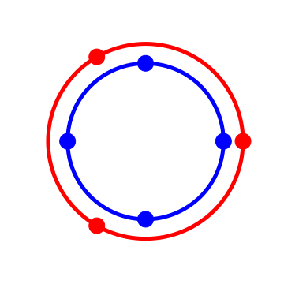

<iframe src="../scripts/s.html" width="600px" height="220px" style="margin: 0 auto; display: block; width : 100%;"></iframe>
The very nature of a polyrhythm is to be circular. Everything in music tends to be circular to some extent. Geometric interpretation in music always fascinated me, I don’t quite understand why music I love makes me think about space, movement, symmetry, rotations. 

Maybe because of my initial formation or day to day work, I began to think about representing polyrhythms with complex exponentials. Circular representation are quite common on Youtube for grasping composite rhythms of polys such as 4 against 3 or 5 against 3.

I provide here a way to look at polyrhythms visually from a phasor perspective.
# What is a phasor ?

A phasor is a mathematical construction defined as :

$$e^{i\theta(t)}$$

If $$\theta(t)$$ is linear to t, a phasor simply describe a constant velocity circle trajectory. The frequency of the phasor is related to the linear coefficient applied to time.

# What is a polyrhythm ?

A polyrhythm is the presence of multiple rhythms simultaneously. We can abstract mathematically this idea by taking two different numbers $$x$$ and $$y \in \mathbb{R}$$. If we can succeed to arrange on two different axis $$x$$ and $$y$$ ticks such as the two first and last elements are aligned, then we would obtain a $$x$$ against $$y$$ polyrhythm. By linearly following the axes, we would hear $$x$$ beats against $$y$$ beats in time. 

  

If we were to represent both rhythm on the same axis, we might ask ourselves what is the minimal elementary step we need for our scale to perfectly fit the beats. The total number of step must be divisible by $$x$$ and $$x$$.  In other word the least common multiple is the number of steps we need.

$$LCM(x,y)$$

Because of the circular nature of the polyrhythm it feels a bit weird to unroll an axis like that, it would be much more natural to visualize it in a periodic fashion. So let’s wrap this axis around a circle.

  

Ever wondered what 9 against 15 looks like ? (yeah sure you did)

  

Now this is too tempting not to use phasors to understand this. Beware, mathematical notation might appear.

With $$\alpha, \beta, \lambda \in \mathbb{R}$$ consider the set $$A$$ of points $$z \in \mathbb{C}$$ such as

$$z^{\alpha} = e^{i2\pi\lambda}$$  

and the set $$B$$

$$z^{\beta} =e^{i2\pi\lambda}$$   

$$\lambda$$ parametrizes the duration of the polyrythm. We set the reference $$\lambda = 1$$ for one bar duration. We can derive for one set the angle solutions.

$$e^{i\theta\alpha} = e^{i2\pi\lambda}$$

$$\theta \alpha = 2\pi\lambda k$$

$$A=  \left\{\frac{2\pi}{\alpha}\lambda k \vert k \in [0, \alpha[ \right\}$$

Similarly :

$$B = \left\{\frac{2\pi}{\beta}\lambda k \vert k \in [0, \beta[ \right\}$$

Finally we define the 2-component composite polyrhythm :

$$P(\lambda,\alpha,\beta) = A \cap B$$

Notice that $$P(\lambda,\alpha,\beta) = P(\lambda,\beta,\alpha)$$.

In other words, two phasors $$A$$ and $$B$$ complete respectively $$\alpha$$ and $$\beta$$ cycles in $$\lambda$$ bars. A bar is typically described by a time signature of the form :

$$ U/V \text{ e.g. } 4/4$$

Where $$V$$ is the fractional beat unit, and $$U$$ the number of beats of type $$V$$ in a bar. To find the two beat values of a given polyrhythm $$P(\lambda,\alpha,\beta)$$ we compute the angle between two points of sets $$A$$ and $$B$$. For instance, a $$U/V$$ bar being divided in $$U$$ beats of $$V$$, we have the correspondence $$2\pi = U \times V$$. Therefore the beat values are :

$$ \frac{\lambda UV}{[\alpha, \beta]}$$

To get a bit of fresh air, suppose we want to create a 3 against 4 polyrhythm in $$4/4$$ that lasts one bar, or more succinctly $$P(\lambda = 1,\alpha = 3, \beta = 4)$$. Equation [1] tells us that the $$A$$ phasor plays note of value

$$ \frac{1 \times 4 \times 1/4}{4} = 1/4$$

or more commonly called fourths. While the phasor $$B$$ plays notes of value

$$ \frac{1 \times 4 \times 1/4}{3} = 1/3$$

Which would be notated as one triplet half note, I guess.

To demonstrate how powerful this representation is, suppose we are doing a 5 against 7 in $$13/8$$ that lasts one and a half bar, mind twisting right ? For $$P(1.5,5,7)$$ in $$13/8$$.

A phasor plays :

$$ \frac{1.5 \times 13 \times 1/8}{5} = 36/80 = \frac{9}{20} =  \frac{1}{4}+\frac{1}{3}$$

So that would be one quarter note and a triplet half note.
B phasor plays :

$$ \frac{1.5 \times 13 \times 1/8}{7} = 36/112 = \frac{9}{28} = \frac{1}{4} + \frac{1}{14} $$

And that’s one quarter and one septuplet quarter note.

Follow up soon..
