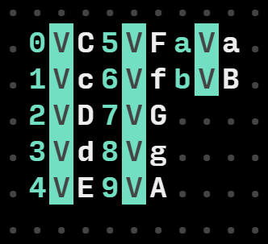

# Programming chords with ORCΛ

#### *by Alexis LOUIS*

ORCΛ is a live programming environment, a bit like a cellular automata, where a grid of operators are triggered and/or triggering state changes. The originality of ORCΛ is that every operator are represented as letter (from A to Z), each one having a particular role [(list here)](https://github.com/hundredrabbits/Orca). If you ever played Factorio, programming in ORCΛ feels a bit like playing Factorio. The build-in capabilities of MIDI and UDP sends clearly shows that it was developed in the objective of serving some musical production purpose, but really you could illuminate LEDs, controls motors or do anything interactive with it. It still has to be demonstrated that you can code nearly every function with it (work in progress...) but I'm pretty confident you could (at the cost of a lot of time and dedication).

I won't review the basics of how ORCΛ works (it's fairly intuitive) but go in depth about how to create chords with it, a pilar concept of music theory that is not directly implemented in ORCΛ. At the moment, only tokens from C to G (with lowercases being sharps, c is C#) have a musical concept attached to them usable directly in MIDI, UDP or OSC commands.

## Chords ?
Simply put, a chord consists in essence as a root and more than one intervals built upon the root. In tempered 12 tone systems, an octave (from frequency f to 2f) is divided in 12 equal parts. In that sense we often count in semi-tones, the semi-tone being the smallest pitch unit available. Going 12 semitones up from a root gives us an interval of a perfect octave. Going 7 semitones up from a root is what we call a fifth, even if the actual definition of harmonic fifth (being a frequency ratio from f to 3/2f) is not quite what we are doing when going 7 semitones up. 

*This phenomenon occurs because of the way we divided the octave (in 12 equal parts) : going 7 semi-tones up from f actually jumps to 2(7/12)f, which is quite close but not equal to 3/2f. That's why every note you hear nowadays apart from the octave are objectively not in tune, but that's another subject.*

A chord can contain many different intervals, every combination (and their arranging, called voicing) providing some sense of musical color. Moreover, from the succession of chords, called a progression, can arise a context in which two same chords will *feel* different. Rhythm, articulation, tone and more are variables that alter the musical color of a chord, but the set of intervals clearly play the major (no pun intended) role in giving the basic color of a chord.


## Defining the ORCΛ program 
ORCΛ encourages you to automate thing as well as interact with the interface. So my first idea was to implement a program that would compute the right notes, given a root and a list of intervals I could easily change. As an example, I should be able to specify the root note (C for example), with the intervals [4, 7] and get from the output the notes C E G, the C major chord in root position. 

## Program implementation

The twelve tones that can are understood by orca are defined as : {C, c, D, d, E, e, F, f, G, g, A, a, B, b}. It doesn't adds up to twelve because e (=E#) is enharmonic to F, as well as b (=B#) to C. It makes no difference to use one or another in the actual implementation. 

Because you can count from 0 to z  in ORCΛ and that uppercases are interpreted as lowercases in value, you can't simply add 4 to C to get a D, you would get the result of the operation c +4, which is d. We can bypass this limitation by first assigning 12 ascending variables to the 12 semitones starting from C, which we will manipulate to create chords. For simplification, let's call this ordering the 12-tone array.



By defining those variables in ascending order, we can fetch the actual 12 tones ordering of notes by executing operations on variables names. We could also choose not to use 12 tones but a particular scale, in which case all interval combinations would create chords diatonic to that scale. 

With this 12-tone array, one can go from C (var 0) to D (var 2) by adding 2 (semitones) to the variables names (or index), which is correct according to music theory. The addition operator (A) outputs the variable name (index) which has to be looked up from the 12-tone array to get the correct note. But if I add 3 to var 9 (which corresponds to the note A), I get 9+3 = var d which is not assigned to a variable. Caution here : because we use variables names that could also be note names (like the d here), we shall be careful in the separation of the two concepts. This is the reason we have to only stay in the interval [0, b] when outputting variables indexes. We can constraint the addition result to this interval by adding a Modulo operator 12(c) after each addition result. If we do not use the quotient to correct to actual octave skip, this effectively wraps every interval into the same octave. This sequence of addition/modulo defines the interval unit logic.


The number of notes in a chord only depend on how many times you repeat this interval unit. Here is an example of 4-notes chord, a Cmin7 (Root : C (var 0), Intervals = [3, 7, 10(=a)])


And there you have it, by correctly defining the twelve tones as ascending variables, doing modulus addition of interval values, we just implemented a compact program yielding chords. Send the resulting notes as MIDI messages into your favorite DAW and hear the chord change as you wonder over roots and interval values.

Building chord progressions is a simple extension to chords where you automate the changes in root values and interval values. Example of code progression :

<div style="text-align:center;">
<video  style="margin: 0 auto; width: 100%; max-width: 1020px;" autoplay loop="loop">

```
   <source src="../images/orca/demo.mp4" type="video/mp4" />
```

   </video>
</div>

You could note that one modulo is inactive (for the root), which keep the bass note steady for 2 measures. This has a nice voice leading effect, but changes the quality of the chord.

Enjoy ! :)

